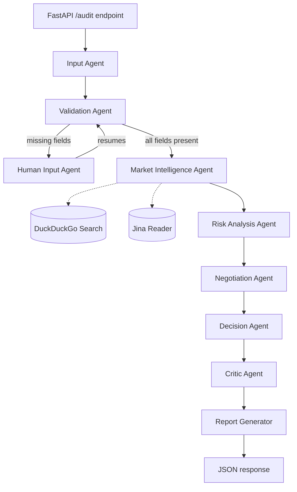

# Agentic Car Auditor


Agentic Car Auditor is a LangGraph-based multi-agent system that evaluates used cars before purchase. Multiple specialized agents collaborate to validate vehicle details, analyze market listings, assess risk, generate a negotiation strategy, and produce a final buy / negotiate / avoid recommendation.

Rather than returning a single price estimate, the system evaluates market value, identifies risks, generates a negotiation strategy, and produces a final recommendation .

**Demo** :https://agentic-car-auditor.onrender.com/docs 

## Features

- Extracts structured vehicle details from natural language input
- Human-in-the-loop: pauses and asks for anything missing instead of guessing
- Pulls live pricing from used-car marketplaces to build a market estimate
- Scores risk based on vehicle age, mileage, and ownership history
- Generates an offer price, target price, and walk-away price
- Produces a clear Buy / Negotiate / Avoid recommendation
- Critic step reviews the output before the final report ships
- Session persistence so a paused workflow can resume later
- Structured audit report combining every agent's output

## Architecture



Each box is a node in the LangGraph workflow. Human Input only runs when a required field is missing — otherwise the graph goes straight from Validation to Market Intelligence. Market Intelligence is the only stage that reaches out to external services.

### What each agent does

**Input Agent** — parses the free-text vehicle description into structured fields.

**Validation Agent** — checks that all required fields are present before continuing.

**Human Input Agent** — pauses the workflow when something's missing and resumes once the user provides it.

**Market Intelligence Agent** — searches listings, pulls pricing, filters out irrelevant results, and produces a market valuation.

**Risk Analysis Agent** — scores the car on age, mileage, and ownership history, with reasons attached.

**Negotiation Agent** — calculates an offer price, target price, and walk-away price from the market valuation and risk profile.

**Decision Agent** — turns all of that into a final call: Buy, Buy with negotiation, or Avoid.

**Critic Agent** — critic Agent reviews the recommendation before the final report is generated

**Report Generator** — combines every agent's output into one structured audit report.

## Human-in-the-loop

The system doesn't fill gaps with assumptions. When something's missing:

1. Validation Agent flags the missing fields.
2. The workflow pauses and session state is saved.
3. The user provides the missing details.
4. The workflow resumes from validation, not from the start.

This means an incomplete input doesn't have to mean starting over.

## Example

**Input**

```json
{
  "brand": "Maruti",
  "model": "Alto",
  "year": 2008,
  "fuel_type": "Petrol",
  "km_driven": 180000,
  "owner": "second owner",
  "city": "Chennai"
}
```

**Output**

```json
{
  "recommendation": "AVOID",
  "risk_level": "HIGH",
  "avg_market_price": 167500,
  "offer_price": 134000,
  "target_price": 150750,
  "walk_away_price": 159125
}
```

## Tech stack

**Backend** — Python, FastAPI, LangGraph, LangChain, Pydantic

**LLM** - Groq 

**Data sources** — DuckDuckGo Search (DDGS), Jina Reader

**State management** — in-memory session storage with pause/resume support

## Project Structure

```text
Agentic-car-auditor/
│
├── backend/
│   ├── api/
│   ├── config/
│   ├── graph/
│   │   ├── nodes/
│   │   ├── workflow.py
│   │   ├── state.py
│   │   └── routers.py
│   ├── prompts/
│   ├── schemas/
│   ├── services/
│   ├── main.py
│   └── requirements.txt
│
└── README.md
```

## Running locally

```bash
git clone <repo-url>
cd backend
pip install -r requirements.txt
uvicorn main:app --reload
```

Server runs at `http://127.0.0.1:8000`.

## A note on the market data

Prices come from scraping public listing pages rather than a paid pricing API, so there's a real limit to how precise the market estimate can be — especially for models that share a name across generations (an Alto and an Alto K10, for instance). The pipeline pairs each price with a nearby year/mileage mention to reduce cross-contamination between generations and tags each estimate with a confidence level, but it isn't foolproof. Treat the numbers as a strong starting point for negotiation, not a certified valuation.

## Future improvements

- Redis-based session storage instead of in-memory
- Additional marketplaces for broader listing coverage
- Vehicle history/inspection integration
- Frontend dashboard
- ML-based valuation model as a second signal alongside live listings
- Replace rule-based risk scoring with data-driven risk models
